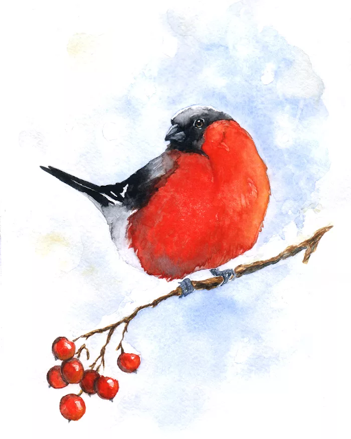
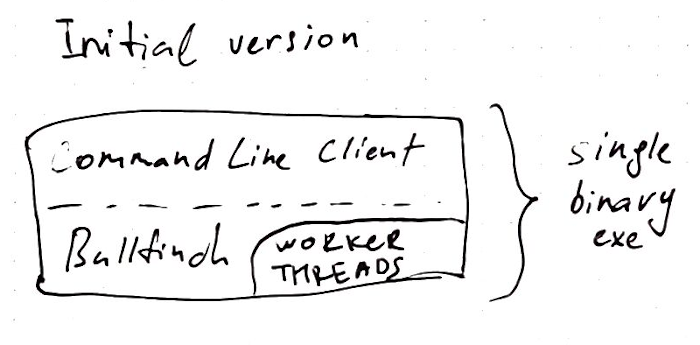
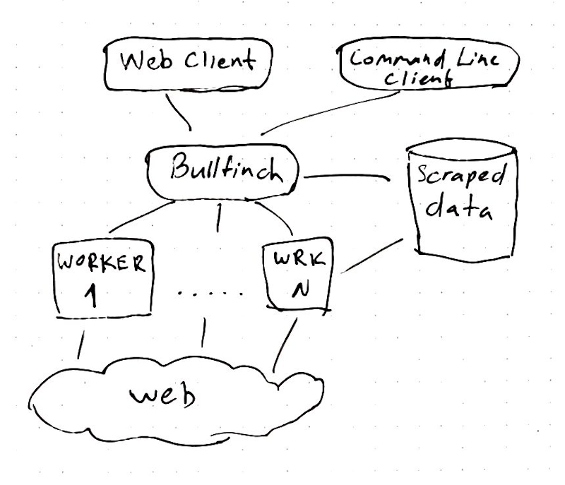

<p align="center">
  
</p>

# Bullfinch

Bullfinch is an extremely simple web crawler written in Rust for learning purposes.

## Use
To run command line client:

```
cargo run --bin bf-client -- -v links  http://www.google.com 1
```

To run web service:
```
cargo run --bin bf-server
```
The server will bind to 127.0.0.1:8088 and will expose the following endpoints:
```
Get lists of registered domains that are being crawled:
"/api/v1/domains"
Get links for a given domain id:
"/api/v1/links/{domain_id}"
Get number of visited pages for a given domain id:
"/api/v1/num/{domain_id}"
```
Example use:
```
curl -i -H "Accept: application/json" "127.0.0.1:8088/api/v1/links/1"
```
There is a helper script at misc/client.py that makes requests to these endpoints.

## Example

```
use bullfinch::error::BfError;
use bullfinch::Crawler;

fn main() -> Result<(), BfError> {
    let u = "https://www.thetimes.co.uk/";
    let mut crawler = Crawler::new(u)?;
    crawler.crawl_depth = 1;
    crawler.verbose_log = true;
    // This does not block
    crawler.start();
    // Wait to give crawler some time to crawl
    std::thread::sleep(std::time::Duration::from_secs(1));
    println!(
        "Found {} unique links (at a depth level {}).",
        crawler.visited.lock().unwrap().len(),
        crawler.crawl_depth
    );
    Ok(())
}

```

## Architecture
### Current
Currently there is just a single binary that serves as a command line interface (CLI)


Web interface is implemented also as a single binary using actix_web.

Visited links are stored in a HashSet, although Bloom filter might be a better choice[^1].
Main thread checks whether the link that we encounter has been visited, if not it is sent to worker threads. Communication is implemented using crossbeam-channel.
Other approach would have been to use Arc<Mutex<>> queue to append new links for fetching.

### Planned

In the future it will roughly look like this:


## Improvements
Immediate issues that should be addressed:

* Adhere to robots exclusion standard (robots.txt)
* Logging - use slog instead of println. Verbosity levels.
* Error handling - close to none at the moment. Need to define our own error type and wrap all other errors[^2].
* Persistency - serialize and save visited links to disk

[^1]: http://www.michaelnielsen.org/ddi/how-to-crawl-a-quarter-billion-webpages-in-40-hours/
[^2]: https://blog.burntsushi.net/rust-error-handling/
